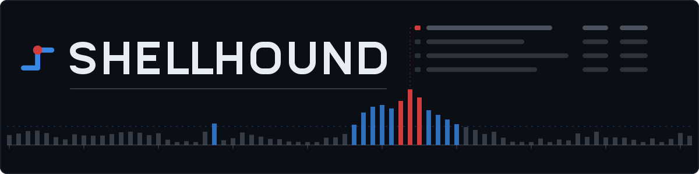
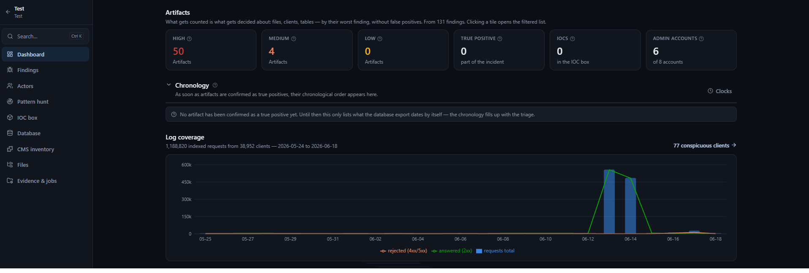
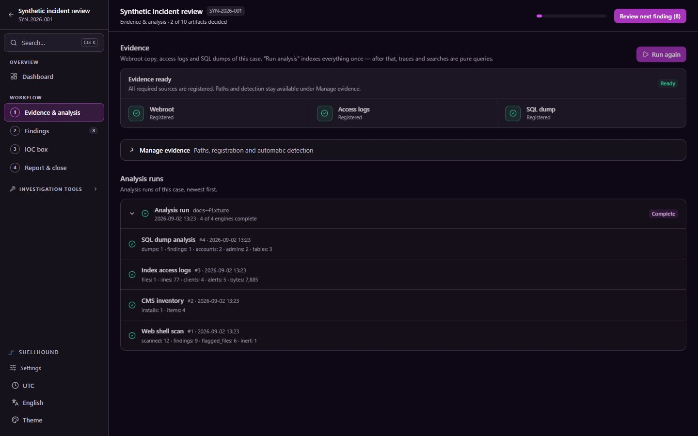
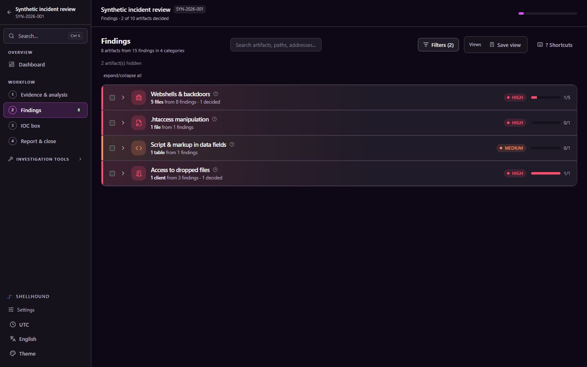
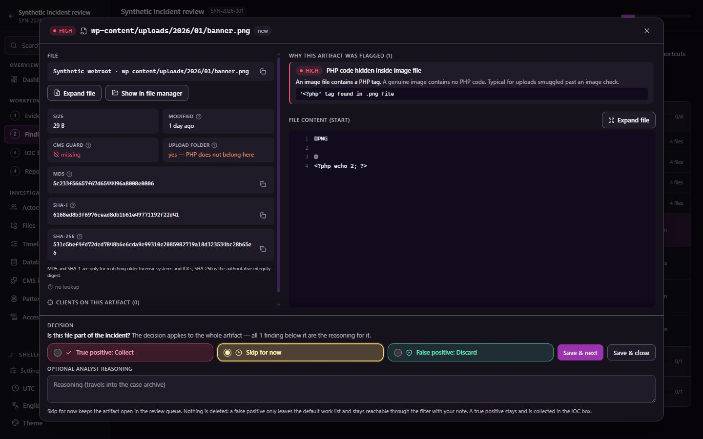
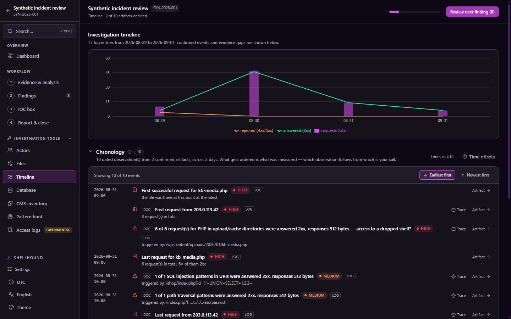
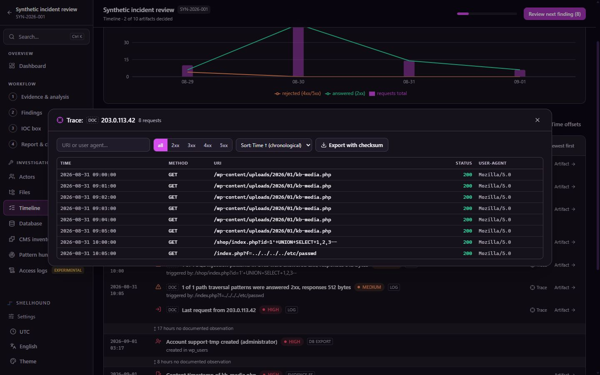
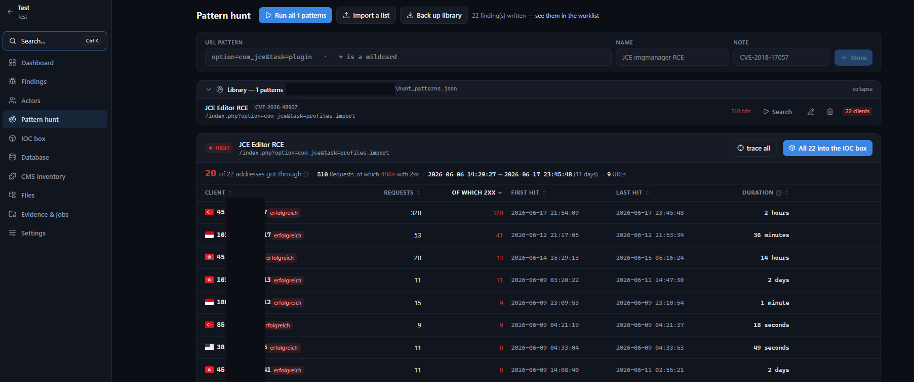
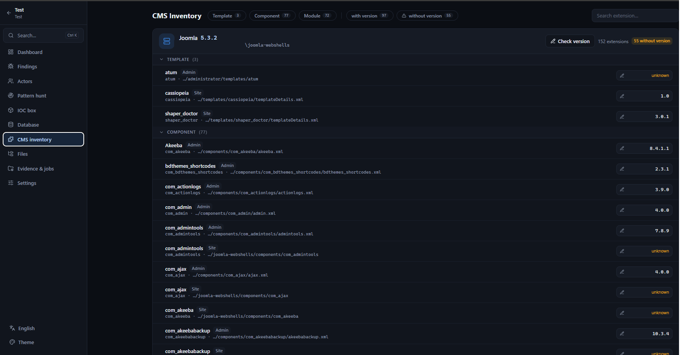
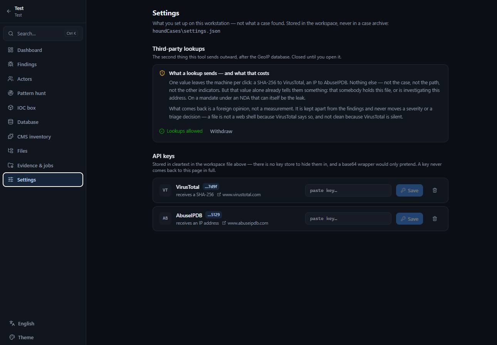

<p align="center">
  
</p>

**Local DFIR workbench for compromised web servers.**

SHELLHOUND indexes a copy of the webroot, the access logs and a database
export once. Every question after that is a query against the index instead of
another pass over gigabytes: which files are suspect, which clients requested
them, when a file was first present, what those clients did next.

| | |
|---|---|
| **Input** | Copy of the webroot, access logs, database export of the CMS |
| **Output** | Findings and triage state, chronology, IOC export as CSV, JSON or STIX 2.1 |
| **Operation** | Entirely on the analysis machine, on `127.0.0.1`. No service, no account, no telemetry |
| **Interface** | English and German, switchable in the sidebar |



---

**Contents** — [Installation](#installation) · [Workflow](#workflow) ·
[Views](#views) · [Configuration](#configuration) · [Security](#security) ·
[Development](#development) · [Contributing](#contributing)

---

## Installation

| Component | Version | Needed for |
|---|---|---|
| Python | ≥ 3.10 | Server and engines |
| Node | ≥ 20 | Building the interface only |

```bash
git clone https://github.com/Mateodevv/shellhound.git
cd shellhound && pip install -r requirements.txt
cd web && npm ci && npm run build && cd ..
python -m server.main
```

The browser opens at `http://127.0.0.1:8710` with a token in the URL. The
workspace directory is created on first start.

### Your own rules

The shipped rules are opinionated, which is useful right up to the moment
somebody arrives with a rule set of their own. Both formats that already exist
for that are supported, and neither gets a dialect added to it.

| | Format | Where | Runs over |
|---|---|---|---|
| Files | YARA | `<workspace>/yara/*.yar` | The webroot copy |
| Logs | SIGMA | `<workspace>/sigma/*.yml` | The access log index |

They belong to the workspace, not to a case: a rule set grows across cases.
YARA files are written under *Settings* — write, edit, switch off, delete — or
dropped into the folder, so a set from a CERT or a vendor feed arrives
unchanged. Saving compiles first: a rule that does not compile costs that file
and not the scan, and hearing it at save time beats hearing it mid-case. A file
is switched off rather than edited, because it may be somebody else's text.

**A SIGMA rule this tool cannot answer is refused at load, by name, with the
reason** — never loaded and left to match nothing. What is supported and what
is not is in [`docs/rules.md`](docs/rules.md).

### Optional components

| Feature | Requirement | Without it |
|---|---|---|
| Country flags for IP addresses | A GeoIP database (`.mmdb`), fetched in *Settings* or pointed at with `SHELLHOUND_GEOIP` | Everything works, only without flags |

Country attribution reads a local database and never queries a lookup service.

<details>
<summary><b>Installation as a package</b> (provides a <code>shellhound</code> command)</summary>

The built interface is bundled into the package, so an installed copy needs no
Node toolchain. Building the wheel does, and the build output has to be copied
into the package first.

```bash
cd web && npm ci && npm run build && cd ..
```

Copy the build output:

```bash
cp -r web/dist server/static
```

```powershell
Copy-Item -Recurse -Force web/dist server/static
```

Then:

```bash
pip install .
shellhound
```

Inside the repository the copy is unnecessary; there the server finds
`web/dist` by itself.

</details>

## Workflow

### 1 · Evidence

Work on copies. Four kinds of evidence go in, three of them are needed to
start.

| Kind | What it is | Needed to start |
|---|---|---|
| Webroot | Copy of the web directory | yes |
| Access logs | Apache or Nginx, `.gz` included | yes |
| SQL dump | Database export of the CMS | yes |
| Reference copy | Clean CMS release of the same version | no, enables the webroot diff |

### 2 · Registration

New case → *Evidence & jobs* → enter the paths.

Alternative: enter the folder the evidence sits in and use **Detect evidence
automatically**. It recognises webroot, logs and database export by their
content (CMS markers, parsable log lines, dump headers) and states the reason
for each proposal.



### 3 · Analysis

*Analyse* runs the engines once, at roughly 55,000 log lines per second. On a
million log lines this is the only slow step of a case; everything after it is
a query. The jobs run in the background, each reports its own progress and can
be cancelled.

### 4 · Triage

*Findings*.

## Views

### Findings

37 rules across webroot, database export and logs produce findings
([`docs/rules.md`](docs/rules.md)). The work list is not a list of findings:
findings are grouped into the object they are about, a file, a client or a
table, and the decision is made once per object. Five rules firing on one
dropped shell are five observations about one thing, not five decisions.



| Key | Action |
|---|---|
| <kbd>j</kbd> / <kbd>k</kbd> | Next / previous artifact |
| <kbd>Enter</kbd> | Detail window |
| <kbd>c</kbd> | True positive |
| <kbd>d</kbd> | False positive |
| <kbd>r</kbd> | Reviewed |
| <kbd>x</kbd> | Check |

The detail window holds what the decision is made on:

- the file content around the offending line,
- every rule that fired, with its reasoning,
- the clients that loaded this file according to the log.



**True positive** carries path and SHA-256 into the IOC box, together with the
requesting clients. Clients whose requests were never answered successfully
are suggested, not decided. The propagation stops after exactly one step, so
no chain of conclusions is built automatically.

**False positive** is not deleted. The artifact leaves the work list and stays
reachable through the filter, with the note attached.

### Chronology

The confirmed artifacts in temporal order, every line naming its source. The
view orders observations and derives no causes.



- The presence of a file is dated by its **first successful request** in the
  log, not by the mtime of the copy. An mtime can be set by an attacker and
  says nothing about where the copy came from.
- Gaps are stated, not closed.
- If log server and database server disagree about the time, the offset can be
  set per source. It is stored and reported in the chronology.

### Trace

Every request from a selection of clients, with the activity of that selection
over time.

| | |
|---|---|
| **Filter** | URI, user agent, status class, method |
| **Sort** | Time, status, size, URI |
| **Export** | ZIP with manifest and SHA-256 |



The timeline always describes the whole period. It does not change with paging
or filtering, otherwise it would answer a different question on each look.

### Pattern hunt

Runs a URL pattern, for example the path from a CVE, against the log index and
reports who requested it, how often, how much of it worked, and over what
stretch of time. Runs without a hit are recorded as well.



**A pattern is four fields and one condition:** one or more paths, a name, the
advisory it belongs to, and what a hit proves.

Several paths in one entry are combined **over clients**, not over a single
request — a URI cannot be two paths at once. `any` counts a client that hit at
least one of them; `all` only clients that hit every one. "This address
fetched the exploit path AND the file it dropped" is a different claim from
"it fetched one of them", and the one that survives being questioned.

The library has two halves, and which half a pattern came from is recorded on
every finding it produces:

| | Lives in | Editable | Removable |
|---|---|---|---|
| **Shipped** | The package ([`server/patterns_bundled.json`](server/patterns_bundled.json)) | No | Switched off per workspace |
| **Own** | `<workspace>/hunt_patterns.json` | Yes | Yes |

Shipped patterns are identical on every installation of a version, which is
what lets a report cite one; that is also why they are read-only, since an
entry that changed while keeping its id and its CVE would mean two different
things on two machines. An upgrade brings new entries without touching the own
half, and entries switched off stay off.

The shipped set is deliberately short. A pattern that ships is one every
installation runs, so a false positive there does not cost one analyst a look
— it costs all of them a filled work list. Entries are added when somebody has
hunted with them, through the
[hunt pattern issue form](https://github.com/Mateodevv/shellhound/issues/new?template=hunt_pattern.yml),
not because a path appears on a scanner list.

Every pattern carries a **description**: what a hit proves, and what it does
not. It is the field that is worth something six months later, when the CVE
number alone no longer says why the path was on the list.

Nothing runs automatically. A match proves that a request was made — the
status code decides the rest, and the hunt reports it.

The export carries the own patterns only, descriptions included. The shipped
ones travel with the tool, so exporting them would arrive as duplicates.

### CMS inventory

Every extension with its version and the source the version was read from.
WordPress and Joomla in detail; Drupal, TYPO3, Magento, PrestaShop and Contao
are recognised, and their accounts read generically.



### Further views

| View | Contents |
|---|---|
| **Actors** | Every client from the logs with its behaviour, country and duration of activity. Several can be selected for one combined trace |
| **Database** | Accounts with named observations (created on the day of the export, never signed in, blocked), code injected into data fields, table inventory |
| **Files** | Browse the evidence, take files into the IOC box by hand, compare against the reference copy |
| **IOC box** | The collected indicators with their relationships, exportable as CSV, JSON or STIX 2.1 |

### Third-party lookups

Optional, off until switched on in *Settings*. One value leaves the machine
per click:

| Service | Transmitted value |
|---|---|
| VirusTotal | one SHA-256 |
| AbuseIPDB | one IP address |

Nothing else is sent: not the case, not the path, not the other indicators.



The result is a foreign opinion, not a measurement. It is kept apart from the
findings and never moves a severity or a triage decision.

## Configuration

| Option | Meaning |
|---|---|
| `--workspace PATH` | Where cases are kept, default `~/ShellhoundCases` |
| `--port PORT` | Default `8710` |
| `--host HOST` | Default `127.0.0.1`; a different bind requires `--token` |
| `--token TOKEN` | Fixed access token instead of a random one per start |
| `--no-browser` | Do not open a browser automatically |

| Environment variable | Meaning |
|---|---|
| `SHELLHOUND_WORKSPACE` | Workspace directory |
| `SHELLHOUND_GEOIP` | Path to a GeoIP `.mmdb` file |

A case is a directory. `logindex.db` is derived from the logs and is not
archived. API keys live in `<workspace>/settings.json`, in the workspace and
never in a case archive.

## Security

**The material under examination contains working attack code.** Recommended:
an isolated machine, copies of the originals only, and an antivirus exception
for the evidence directory.

Single-seat tool, no user accounts, no TLS. For access from another machine an
SSH tunnel is the intended route, not a bind to `0.0.0.0`.

Outbound network access happens in exactly three places, all optional and all
opt-in:

| Request | Transmitted value |
|---|---|
| GeoIP database download | — |
| VirusTotal lookup | one SHA-256 |
| AbuseIPDB lookup | one IP address |

None of them transmits case data beyond the single value of the lookup.

Full threat model and how to report vulnerabilities:
[SECURITY.md](SECURITY.md).

## Development

Interface with hot reload:

```bash
cd web && npm run dev
```

Server:

```bash
python -m server.main --no-browser --token dev
```

The interface is then at `http://localhost:5173/?token=dev`.

Tests run without additional dependencies:

```bash
python -m unittest discover -s tests -t .
```

They build their own evidence: tiny, invented files, each triggering exactly
one rule. A failure names the broken rule instead of pointing at a large lump
of data.

### Layout

```
<workspace>/       settings.json, hunt_patterns.json, yara/, *.mmdb
  <case>/          case.db, logindex.db (derived), evidence/
server/            FastAPI, SQLite from the standard library
  engines/         accesslog, logindex, webshell, cmsinventory, sqldump,
                   errorlog, yarascan, webrootdiff, detect
  patterns_bundled.json   Hunt patterns shipped with this version
web/               Vite, React, TypeScript, Tailwind
docs/rules.md      Every rule with trigger, statement and limits
```

### Principles

- Triage states survive re-scans; fingerprints are stable.
- Dismissed findings are not deleted, only filtered out.
- Log alerts are outcome-gated: an attack attempt answered with 404 weighs
  differently from one answered with 200.
- Evidence is never served. Findings carry text excerpts; file contents are
  transferred as JSON data.
- Filtered artifacts are always delivered in full.
- Everything the case stores is written in English: origins, notes, evidence
  lines. Only rendered prose follows the interface language. An archive whose
  wording depends on the language selected at the time of a click is worthless
  as evidence.

## Contributing

Bug reports and pull requests are welcome.

- Vulnerabilities do not belong in a public issue, see
  [SECURITY.md](SECURITY.md).
- Contributions **must not contain data from real incidents**. For a
  reproduction, describe the shape of the data or build a minimal example.
- New detection rules belong in [`docs/rules.md`](docs/rules.md) with their
  trigger, statement and limits, and with a test in `tests/` proving that they
  fire.

## License

[Apache-2.0](LICENSE). Third-party components: [NOTICE](NOTICE).
