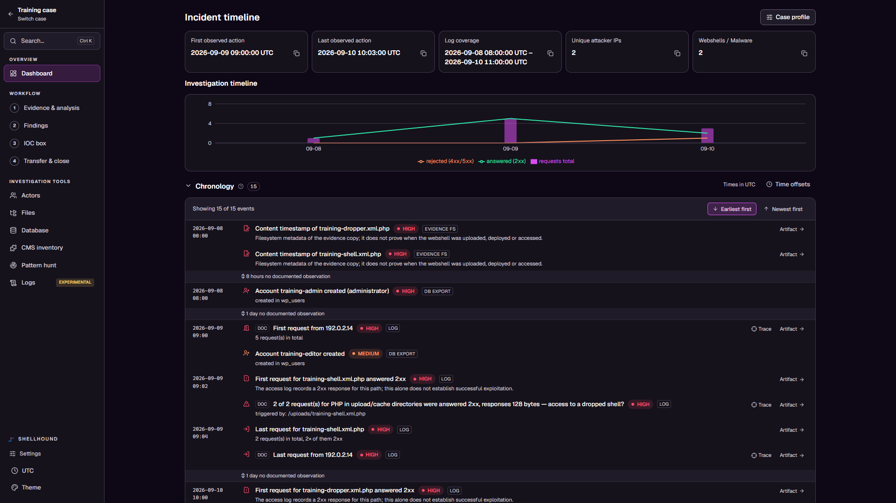
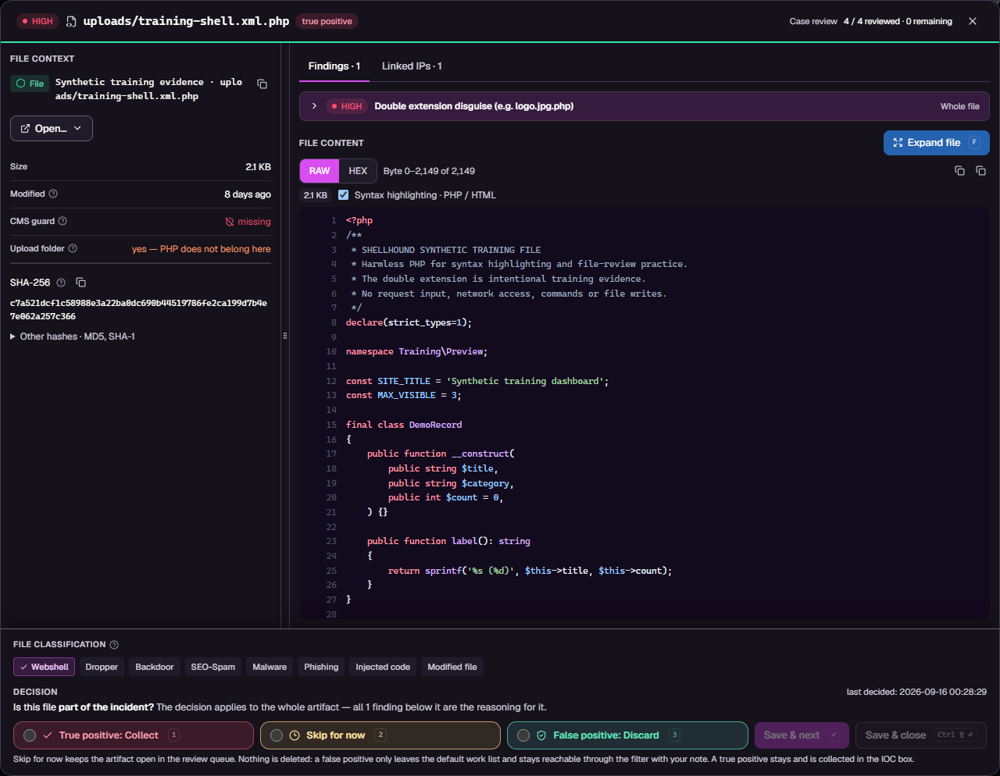
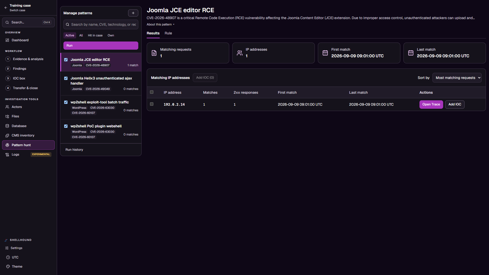

CMS Forensics & Incident Analysis, running locally in your browser.

## Run from source

Install **Python 3.10+**, **Node.js 22.12+ with npm**, and **Git**.
On Linux, install the Python `venv` package if your distribution requires it.

```sh
git clone https://github.com/Mateodevv/Shellhound.git
cd Shellhound
```

- **Windows:** double-click `Start-Shellhound.bat`.
- **Linux / macOS:** run `./shellhound.sh`.

The launcher creates `.venv`, installs dependencies, builds the interface and
opens the local application. Initial setup needs internet access. Cases are
stored in the configured workspace, separately from the source checkout.
Choose **Generate Testcase** on the start screen to try a synthetic case.

## Docker

With Docker Compose installed, follow [local container setup](docs/containers.md)
to configure the access token, evidence mount and persistent case volume, then run:

```sh
docker compose up --build -d
```

## Screenshots

Actual application views using synthetic training data, with example analyst decisions.

**Incident timeline** — confirmed activity, log coverage and a chronological evidence view.



<details>
<summary>File review and Pattern Hunt</summary>

**File review** — syntax-highlighted content, forensic metadata and classification controls.



**Pattern Hunt** — run selected patterns, inspect matching requests and collect IP indicators.



</details>

[License](docs/legal/LICENSE) · [Third-party notices](docs/legal/NOTICE)
